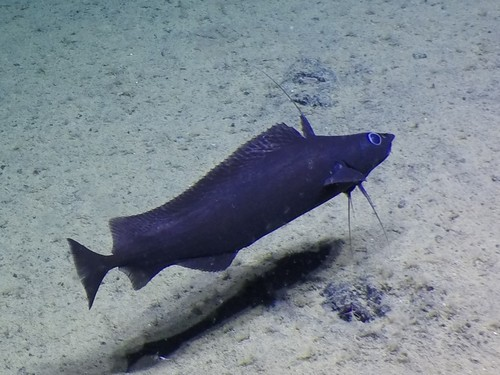
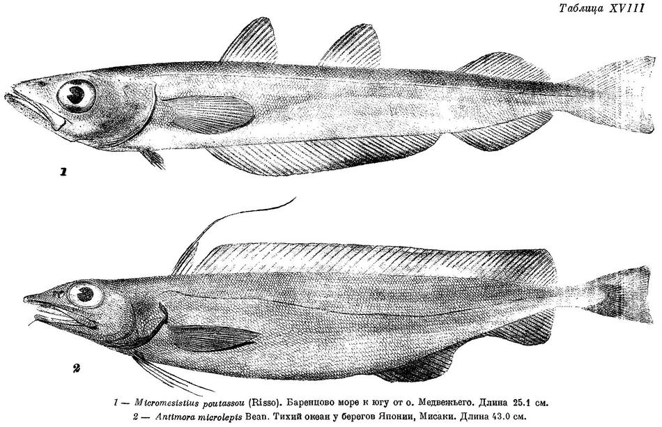

## Libraries and Data Set up

```{r Packages, echo=FALSE, message=FALSE}
library(tidyverse)
library(gtsummary)
library(gt)
library(palmerpenguins)
library(flextable)
library(hexbin)
library(knitr)
library(ggfortify)
library(easystats)
```

```{r data entry, echo=FALSE, message=FALSE}
fish <- read.csv("Data_S1b.csv")
Antimora <- fish %>%
  select(Antimora.microlepis, depth_hi_prec_m, latitude_hi_prec_dd, sample)
Antimora <- filter(Antimora, depth_hi_prec_m + Antimora.microlepis != "NA")
Antimora <- filter(Antimora, sample != "81...")
View(Antimora)
```

```{r ggplot, echo=FALSE, message=FALSE}
ggplot(Antimora, aes(depth_hi_prec_m, Antimora.microlepis)) + 
  geom_point(size=3, pch = 21) +
  geom_smooth(method="glm", method.args=list(family="poisson"(link="log"))) +
  ylab("Number of Fish") +
  xlab("Depth (M)") 
```

```{r ggplot 2}
ggplot(data=Antimora, aes(Antimora.microlepis)) + 
  geom_histogram(binwidth = 5)
```

## Poisson model

```{r model, echo=FALSE, message=FALSE}
model_antimora_poisson <- glm(Antimora.microlepis ~ depth_hi_prec_m, family = poisson, data=Antimora)
summary(model_antimora_poisson)
```

```{r autoplot}
autoplot(model_antimora_poisson)
```

## Quasi model

```{r quasi model, echo=FALSE, message=FALSE}
model_antimora_quasi <- glm(Antimora.microlepis~depth_hi_prec_m, family = quasipoisson, data = Antimora)
summary(model_antimora_quasi)
```

```{r quasi autoplot}
autoplot(model_antimora_quasi)
```

## Gaussian and Linear posson plots

```{r gaussian, echo=FALSE, message=FALSE}
ggplot(Antimora, aes(x = depth_hi_prec_m, y = Antimora.microlepis)) +
geom_point() +
geom_smooth(method = "glm", method.args=list(family="gaussian"(link="identity")))+
#geom_smooth(span = 1, colour = "red", se = FALSE) +
xlab("Depth (m)") + ylab("No. of fish") +
  ggtitle("Linear Model = Gaussian Error Structure, Identity Link")
```


```{r linear poisson, echo=FALSE, message=FALSE}

ggplot(Antimora, aes(x = depth_hi_prec_m, y = Antimora.microlepis)) +
geom_point() +
geom_smooth(method="glm", method.args=list(family="poisson"(link="log"))) +
xlab("depth") + ylab("Number of Fish") +
  ggtitle("Linear Model = Poisson Error Structure, Log Link")
```



[Youtube video on deep sea fish.]{style="color:red"}

<iframe width="610" height="348" src="https://www.youtube.com/embed/wG1je9DDzbg" 
data-external="1">

</iframe>
